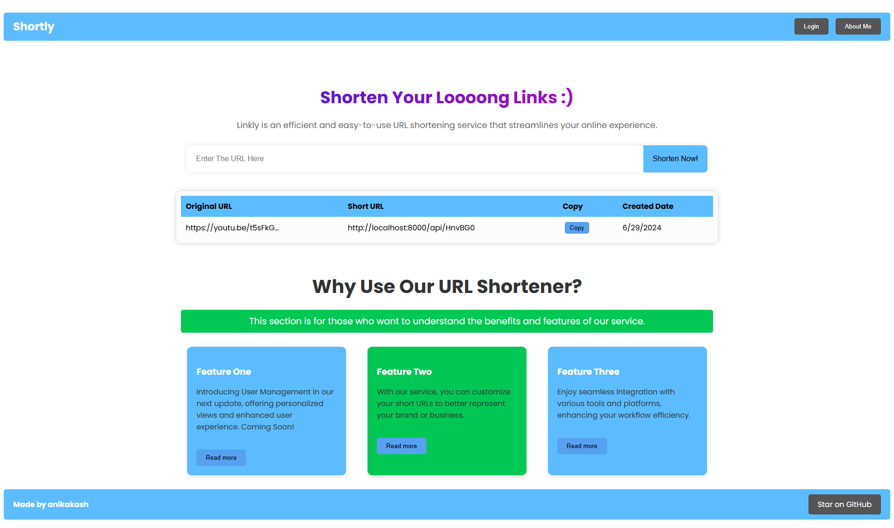

# Shortly - your url shortner solutations:
This project implements a URL shortener service that generates a unique 6-character string for each provided URL. It includes both frontend and backend components, implemented with custom functions instead of relying on npm packages for URL shortening.

# User Interface:

## Implementation Details

**Custom Functions**

Instead of using existing npm packages, custom functions were implemented to handle URL shortening. These functions optimize for both average and worst-case time complexities.

### Unique URL Generator
To generate unique short URLs, a custom function (getUniqueShortUrl) was implemented. This function ensures that each generated short URL is unique for every provided URL. While npm packages are available for this purpose, custom implementation allows for tailored control and optimization specific to project requirements.

### URL Validation
For validating URLs, a custom function (isValidUrl) is used. This function checks whether a given URL is valid based on a set of criteria defined within the project scope. This approach ensures that only valid URLs are accepted and shortened.

## Time Complexity of Custom Functions: 

1. getUniqueShortUrl:

    Average Case: O(1)
    Worst Case: O(n)

2. isValidUrl:

    Average Case: O(n)
    Worst Case: O(n)

# Setup : 

1. Frist clone this repo
    
        https://github.com/anikakash/Shortly.git

2. Navigate to  ``backend`` and ``frontend`` folder and then rum `npm install` in both directory. 

# Now you can run the user interfce from this url: 
    http://localhost:5173

# For testing backend api:

1. URL Shortner: 

        api end point : http://localhost:8000/api/shortner
        Method: Post
        request Body:
        {
            "originalUrl" : "your url"
        }

    Response: 
    

2. Redirect URL:

        api end point : http://localhost:8000/api/:id
        Method: GET
       
     Response: 
    

# Frontend Testing:
*For testign purpose i haven't use .env file to hide rensative url of my db and secrite key.*
## Implemented functionality to retrieve all URLs; future work includes integrating personalized views for logged-in users.